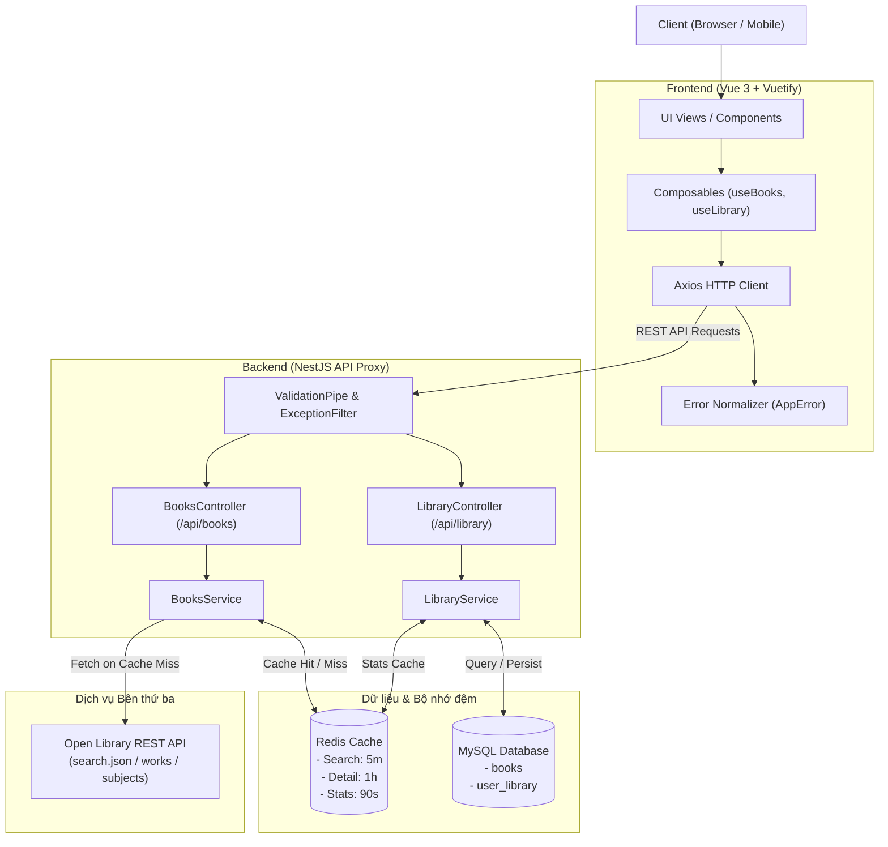
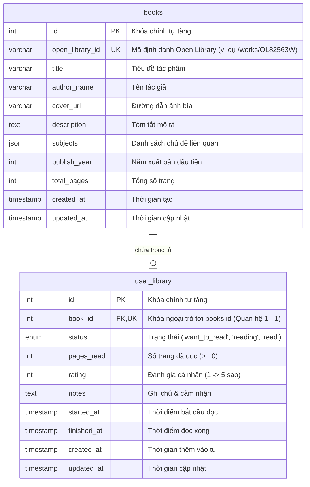

# 📚 Mini Reading Tracker

> Ứng dụng web quản lý tủ sách cá nhân và theo dõi tiến độ đọc sách thông minh, tích hợp tra cứu dữ liệu sách từ Open Library API qua cơ chế Proxy & Caching hiệu năng cao.

---

## 📌 1. Thông tin Dự án & Liên kết Demo

* **Repository GitHub**: https://github.com/huydat2001/Mini-Reading-Tracker
* **Frontend Demo (Vercel)**: https://mini-reading-tracker-rho.vercel.app/
* **Backend Demo (Render)**: https://mini-reading-tracker-5juy.onrender.com
* **Swagger API Documentation**: https://mini-reading-tracker-5juy.onrender.com/api/docs

---

## 📖 2. Giới thiệu Tổng quan & Tính năng chính

**Mini Reading Tracker** là giải pháp hỗ trợ người đọc quản lý quá trình đọc sách toàn diện:

* 🔍 **Tìm kiếm & Khám phá sách (Open Library Proxy)**:
  * Tìm kiếm sách theo từ khóa (tiêu đề, tác giả).
  * Bộ lọc nâng cao: tác giả, chủ đề, ngôn ngữ, khoảng năm phát hành, sắp xếp kết quả.
  * Khám phá nhanh theo chủ đề đa dạng (Tình yêu, Kỳ ảo, Lịch sử, Khoa học, Triết học,...).
  * Backend đóng vai trò Proxy bảo mật, kiểm soát lưu lượng và đệm dữ liệu (Cache) trước khi tới Open Library.
* 📖 **Tủ sách cá nhân & Theo dõi tiến độ**:
  * Thêm sách vào tủ cá nhân với trạng thái tương ứng: *Muốn đọc (`want_to_read`)*, *Đang đọc (`reading`)*, *Đã đọc (`read`)*.
  * Cập nhật số trang đã đọc, tự động tính toán thanh tiến độ trực quan (% hoàn thành).
  * Đánh giá sách (1 - 5 sao ⭐) và lưu trữ ghi chú cá nhân (Notes).
* ⚙️ **Quy tắc Nghiệp vụ Tự động hóa**:
  * Tự động chuyển trạng thái sang `read` và gán thời gian hoàn thành (`finished_at`) khi đọc hết số trang (`pages_read == total_pages`).
  * Tự động lưu thời điểm bắt đầu (`started_at`) khi sách lần đầu chuyển sang `reading`.
  * Ràng buộc dữ liệu nghiêm ngặt: kiểm tra số trang đọc `<= tổng số trang`, chống thêm trùng sách (`409 Conflict`).
* 📊 **Thống kê tủ sách**: Thống kê số lượng sách tức thời theo từng nhóm trạng thái.
* 🛡️ **Xử lý lỗi thân thiện người dùng (Friendly Error Handling)**:
  * Tự động chuyển đổi các lỗi kỹ thuật thô (`timeout 15000ms`, `500 Server Error`, `422 Unprocessable Entity`, mất mạng) thành thông báo tiếng Việt trực quan, kèm lời khuyên xử lý và khu vực "Chi tiết kỹ thuật" cho lập trình viên.

---

## 🖼️ 3. Ảnh chụp Màn hình & Demo

* Đường dẫn github: Mini Reading Tracker\Anh demo
* Đường dẫn google drive: https://drive.google.com/drive/folders/1kr9dWxlhtnGPGMVa2dCYNiW4Urq4L_WI?usp=sharing

---

## 🛠️ 4. Công nghệ Sử dụng

### Frontend
* **Core**: Vue 3 (Composition API, `<script setup>`, TypeScript).
* **Build Tool**: Vite
* **UI Component Library**: Vuetify 3 (Material Design Components).
* **Icon System**: `@mdi/js` (Material Design Icons).
* **Routing**: Vue Router 4
* **HTTP Client**: Axios với Interceptors chuẩn hóa xử lý lỗi.

### Backend
* **Framework**: NestJS (Node.js framework theo kiến trúc Modular, Dependency Injection, OOP).
* **Language**: TypeScript.
* **ORM**: TypeORM tương tác với cơ sở dữ liệu quan hệ.
* **Validation & Transformation**: `class-validator`, `class-transformer` với Global ValidationPipe.
* **API Documentation**: `@nestjs/swagger` (Swagger UI / OpenAPI 3.0).
* **HTTP Client**: `@nestjs/axios` (Axios HttpModule) đảm nhận vai trò Proxy sang Open Library.

### Cơ sở Dữ liệu & Bộ nhớ đệm
* **Database**: MySQL 8.0 lưu trữ sách và dữ liệu tủ sách cá nhân.
* **Caching**: Redis 7.0 (In-memory Cache cho kết quả tìm kiếm, chi tiết sách và thống kê tủ sách).

### DevOps & Đóng gói
* **Containerization**: Docker & Docker Compose.
* **Deployment**: Vercel (Frontend SPA) + Render (Backend NestJS Docker/Web Service) + TiDB (Database MySQL Cloud) + Redis Cloud (Cloud-based managed Redis service)

---

## 🏗️ 5. Kiến trúc Hệ thống & Sơ đồ Cơ sở Dữ liệu

### 5.1. Sơ đồ Kiến trúc Tổng thể (Architecture Diagram)



---

### 5.2. Sơ đồ Cơ sở Dữ liệu (Entity Relationship Diagram - ERD)



#### Quy tắc toàn vẹn dữ liệu:
* `books.open_library_id`: Duy nhất (`UNIQUE`), đánh chỉ mục (`INDEX`) để tối ưu hóa truy vấn kiểm tra trùng lặp.
* `user_library.book_id`: Khóa ngoại ràng buộc tới `books.id` với `ON DELETE CASCADE`.
* Ràng buộc CHECK `chk_rating`: `rating IS NULL OR (rating >= 1 AND rating <= 5)`.
* Ràng buộc CHECK `chk_pages_read`: `pages_read >= 0`.

---

## 📡 6. Danh sách API Endpoints

Tài liệu chi tiết tương tác đầy đủ có tại **Swagger UI**: `/api/docs`.

### Sách & Tìm kiếm (`/api/books` - Proxy Open Library)

| Method | Endpoint | Tham số (Query / Param) | Mô tả & Chức năng | Cache Redis |
| :--- | :--- | :--- | :--- | :--- |
| `GET` | `/api/books/search` | `q` (bắt buộc), `page`, `limit` | Tìm kiếm sách theo từ khóa từ Open Library. | 5 phút |
| `GET` | `/api/books/:id` | `id` (Open Library Work ID) | Lấy chi tiết sách, tác giả, mô tả và số trang. | 1 giờ |
| `GET` | `/api/books/subject/:subject` | `subject`, `limit`, `offset`, `details` | Lấy danh sách sách theo chủ đề đề xuất. | 5 phút |

### Tủ sách cá nhân (`/api/library`)

| Method | Endpoint | Body / Query | Mô tả & Chức năng | HTTP Code |
| :--- | :--- | :--- | :--- | :--- |
| `GET` | `/api/library` | Query: `status`, `search` | Lấy danh sách sách trong tủ cá nhân (lọc và tìm kiếm). | `200 OK` |
| `POST` | `/api/library` | `CreateLibraryDto` | Thêm sách mới vào tủ cá nhân. | `201 Created` / `409 Conflict` |
| `GET` | `/api/library/stats` | Không có | Lấy thống kê số lượng sách theo từng trạng thái. | `200 OK` (Cache 90s) |
| `PATCH` | `/api/library/:id` | `UpdateLibraryDto` | Cập nhật tiến độ đọc, số trang, đánh giá hoặc ghi chú. | `200 OK` / `404 Not Found` |
| `DELETE`| `/api/library/:id` | Param: `id` | Xóa sách khỏi tủ cá nhân. | `204 No Content` |

#### Định dạng phản hồi chuẩn (Standard Response Format):
```json
{
  "success": true,
  "data": { ... },
  "error": null,
  "message": "Thành công"
}
```

---

## 💻 7. Hướng dẫn Cài đặt & Chạy trên Môi trường Local

### 7.1. Cách 1: Chạy toàn bộ bằng Docker Compose (Khuyên dùng - Nhanh nhất)

Yêu cầu máy tính đã cài đặt [Docker Desktop](https://www.docker.com/products/docker-desktop/).

1. **Clone repository**:
   ```bash
   git clone https://github.com/huydat2001/Mini-Reading-Tracker.git
   cd Mini-Reading-Tracker
   ```

2. **Khởi chạy toàn bộ dịch vụ (MySQL, Redis, Backend, Frontend)**:
   ```bash
   docker-compose up -d --build
   ```

3. **Truy cập ứng dụng**:
   * Frontend: [http://localhost:8080]
   * Backend API: [http://localhost:3000/api]
   * Swagger UI: [http://localhost:3000/api/docs]
   * Dữ liệu mẫu (Seed Data) đã tự động nạp qua `init.sql`.

4. **Dừng dịch vụ**:
   ```bash
   docker-compose down
   ```

---

### 7.2. Cách 2: Chạy từng phần thủ công (Development Mode)

Yêu cầu môi trường: **Node.js >= 18**, **MySQL 8.0**, **Redis**.

#### Bước 1: Khởi tạo Cơ sở Dữ liệu
* Tạo database `reading_tracker` trong MySQL và chạy script [init.sql](./init.sql).

#### Bước 2: Chạy Backend (NestJS)
```bash
cd Backend

# 1. Cài đặt dependencies
npm install

# 2. Tạo file cấu hình môi trường .env
cp .env.example .env
# Điền các thông tin kết nối MySQL & Redis trong .env:
# DATABASE_HOST=localhost
# DATABASE_PORT=3306
# DATABASE_USER=root
# DATABASE_PASSWORD=your_password
# DATABASE_NAME=reading_tracker
# REDIS_HOST=localhost
# REDIS_PORT=6379
# PORT=3000

# 3. Khởi chạy Backend ở chế độ dev
npm run start:dev
```
Backend sẽ khởi động tại: `http://localhost:3000` (Swagger: `http://localhost:3000/api/docs`).

#### Bước 3: Chạy Frontend (Vue 3 + Vite)
Mở một terminal mới:
```bash
cd Frontend

# 1. Cài đặt dependencies
npm install

# 2. Tạo file cấu hình môi trường .env
cp .env.example .env
# Thiết lập cấu hình:
# VITE_API_BASE_URL=/api
# VITE_BACKEND_URL=http://localhost:3000
# VITE_PORT=5173

# 3. Khởi chạy Frontend
npm run dev
```
Frontend sẽ khởi động tại: `http://localhost:5173`.

---

## 🚀 8. Mô tả Cách đã Deploy (Deployment Details)

<!-- ================================================================= -->
<!-- KHU VỰC DÀNH CHO BẠN TỰ ĐIỀN / BỔ SUNG CHI TIẾT CÁCH ĐÃ DEPLOY       -->
<!-- ================================================================= -->

### 8.1. Frontend (Vercel)
* **Nền tảng**: Vercel.
* **Cấu hình & Các bước thực hiện**:
  * Kết nối GitHub repository với dự án trên Vercel.
  * Root Directory: `Frontend`.
  * Application Preset: `Vite`.
  * Build Command: `npm run build`.
  * Output Directory: `dist`.
  * **Biến môi trường (Environment Variables)**: đặt ở type Config
    * `VITE_BACKEND_URL`: URL Backend Render (`https://mini-reading-tracker-5juy.onrender.com`)
    * `VITE_API_BASE_URL`: `/api`
    * `VITE_ENV`: `production`
  * Cấu hình chuyển tiếp (Rewrites) trong `vercel.json` để hỗ trợ Vue Router HTML5 History Mode.

### 8.2. Backend & Caching (Render)
* **Nền tảng**: Render (Web Service).
* **Cấu hình & Các bước thực hiện**:
  * Language: `Node`.
  * Branch: `main`.
  * Region: `Singapore (Southeast Asia)`.
  * Root Directory: `Backend`.
  * Build Command: `npm install && npm run build`.
  * Start Command: `npm run start:prod`.
  * **Biến môi trường**:
    * `PORT`: `3000`
    * `DATABASE_HOST`, `DATABASE_PORT`, `DATABASE_USER`, `DATABASE_PASSWORD`, `DATABASE_NAME` (kết nối cơ sở dữ liệu trên cloud).
    * `REDIS_URL` / `REDIS_HOST`: kết nối Redis cloud.
  * Tích hợp Health check endpoint tại `/api/health`.

### 8.3. Database (TiDB Cloud MySQL & Redis Cloud)
* Cơ sở dữ liệu MySQL và Redis được cấu hình trên nền tảng cloud và kết nối an toàn qua TLS/SSL.
* Nạp cấu trúc bảng và seed data từ `init.sql`.

---

## ⚖️ 9. Các Giả định, Hạn chế & Hướng Cải thiện

### 9.1. Các Giả định (Assumptions)
* **Người dùng đơn (Single-user)**: Ứng dụng tập trung vào chức năng cá nhân hóa theo dõi đọc sách cho 1 người dùng, chưa tích hợp hệ thống đa tài khoản (Multi-tenant/Authentication).
* **Định danh sách Open Library**: Mỗi tác phẩm được nhận diện duy nhất thông qua Open Library Work ID (`open_library_id` dạng `/works/OL...`).
* **Tổng số trang**: Với các sách mà Open Library không trả về số trang (`totalPages = null`), hệ thống cho phép người dùng tự nhập số trang khi chỉnh sửa tiến độ.

### 9.2. Hạn chế hiện tại (Current Limitations)
* **Thời gian phản hồi từ Open Library**: Dịch vụ Open Library API công cộng đặt tại nước ngoài đôi khi gặp tình trạng nghẽn mạng hoặc phản hồi chậm (> 15 giây). *(Hệ thống đã giải quyết bằng timeout 15s kèm bộ đệm Redis và thông báo lỗi thân thiện để người dùng thử lại).*
* **Chất lượng ảnh bìa**: Một số tác phẩm quá cũ trên Open Library có thể thiếu ảnh bìa hoặc ảnh độ phân giải thấp. Ứng dụng đã xử lý hiển thị bìa dự phòng (Placeholder cover).
* **Tốc độ truy vấn lần đâu: Vì deploy lên các nền tảng severless free nên khi không có truy cấp trong 15p thì hệ thống sẽ tạm đóng băng và khi chưa có cache từ Redis thì tốc độ truy vấn sẽ chậm (tốn khoảng 2-3p để truy vấn được thông tin sách).

### 9.3. Hướng Cải thiện nếu có thêm thời gian (Future Improvements)
* 🔐 **Xác thực & Phân quyền (Authentication & Authorization)**:
  * Tích hợp JWT / OAuth2 (Google, GitHub) hỗ trợ nhiều người dùng với thư viện riêng biệt.
* 🎯 **Mục tiêu đọc sách (Reading Challenges)**:
  * Cho phép người dùng đặt mục tiêu số cuốn sách hoặc số trang cần đọc theo tháng/năm.
  * Biểu đồ theo dõi thói quen đọc sách theo thời gian thực (Charts & Heatmap).
* 📤 **Xuất/Nhập Dữ liệu (Import & Export)**:
  * Xuất danh sách tủ sách ra file Excel / CSV / JSON.
  * Hỗ trợ nhập dữ liệu từ Goodreads.
* 💬 **Chia sẻ & Trích dẫn (Quotes & Social Sharing)**:
  * Lưu trữ trích dẫn hay trong từng chương sách.
  * Tạo ảnh thẻ trích dẫn đẹp mắt để chia sẻ lên mạng xã hội.
* 📱 **PWA & Offline Support**:
  * Đóng gói Progressive Web App (PWA) cho phép mở ứng dụng và xem tủ sách ngay cả khi không có mạng.

---

## 👨‍💻 Tác giả

* **Họ và tên**: [Nguyễn Huy Đạt]
* **GitHub**: [@huydat2001](https://github.com/huydat2001)
* **Dự án**: Mini Reading Tracker
